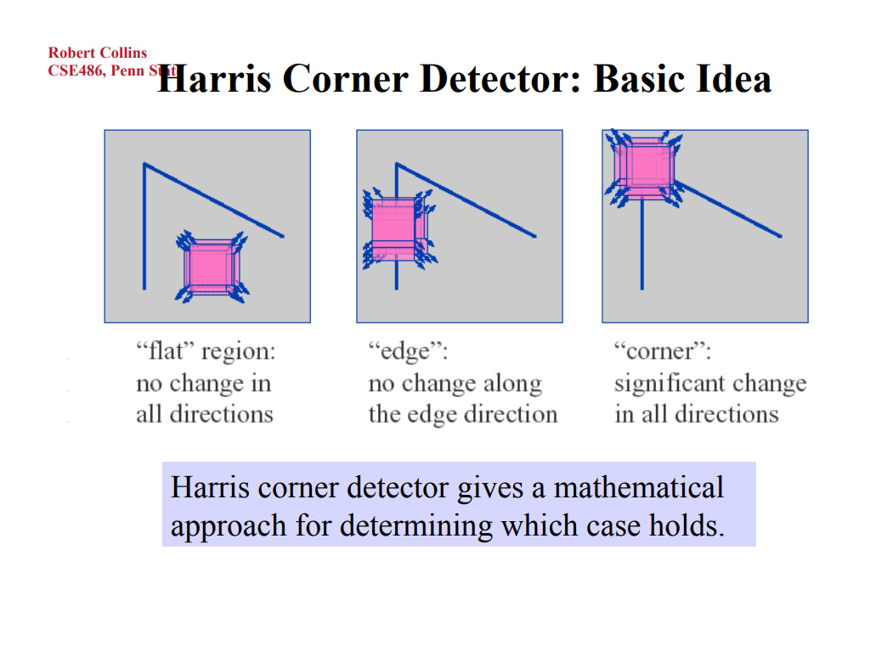

///////////////;<!-- page_number: true -->
<!--$theme: gaia-->

　
# 遥感数字图像处理实验课
## - Harris 角点匹配
<br/><br/>
崔家梁
(cuijialiang@pku.edu.cn2017年9月

---
# 图像匹配
- 寻找图像中的共同点.


---
# 图像中的特征


面特征 : A,B --- 容易重复
边特征 : C,D --- 容易重复
角特征 : E,F --- 不容易重复√

---
#### Harris 角点检测---领域滑动窗口


**二进制文件**

常见的位图文件：BMP,PNG,GIF,TIFF...
编码方式：灰度图(黑白),RGB,CMYK...

---
# Harris 窗口提取特征
图像I中,(u,v)处的Harris特征值为：
记在图像I中，$a + b$


其中w可以是常数,也可以是高斯函数.

---
# 位图打开方式
#### 1.直接从二进制文件打开,读取元数据、数据数组
- 需要预先知道结构信息

**有兴趣的同学可以尝试一下**(不要求)

#### 2.利用已有的库(如pillow,opencv),直接打开到一个结构体
```
# python code
from PIL import Image
im_PIL = Image.open("../img/horse.jpeg")
im_PIL.show() #显示图片
```

---
# Pillow与numpy图片基本操作（演示程序）

---
# 作业1-图片的基本操作
- 打开一张**彩色**图片;
- 对其进行8邻域中位数滤波并保存结果到一个文件;
- 将原始图片转换成灰度图像,并用Prewitt算子对其进行边缘检测滤波,并将结果保存成一个文件;  
**Prewitt算子:**  
  
请于今晚23:59分前提交至 cuijialiang@pku.edu.cn

---
# References
- http://www.cse.psu.edu/~rtc12/CSE486/lecture06.pdf
- http://docs.opencv.org/3.0-beta/doc/py_tutorials/py_feature2d/py_features_harris/py_features_harris.html
